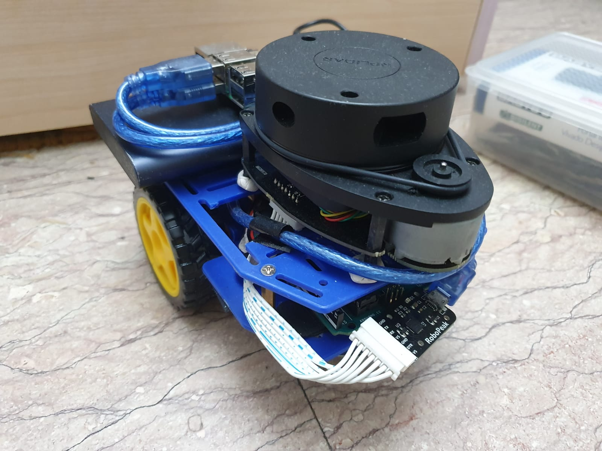
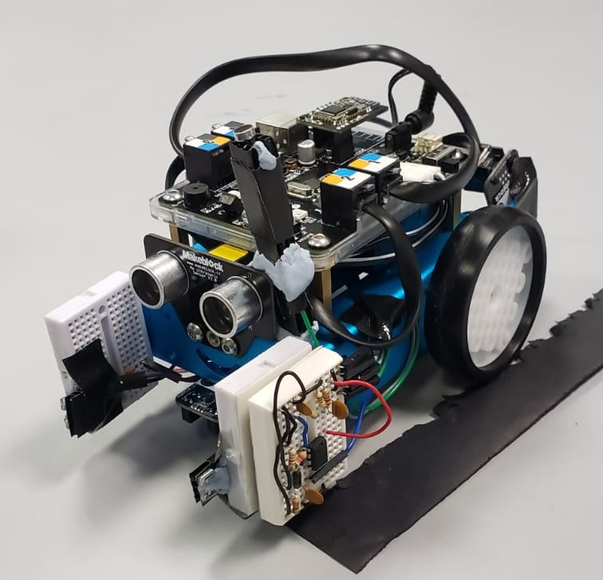

### Hi there 👋

<!--
**prachi2023/prachi2023** is a ✨ _special_ ✨ repository because its `README.md` (this file) appears on your GitHub profile.
-->
I am currently an undergraduate student at National University of Singapore (NUS), pursuing a double degree in Computer Engineering and Business. I am interested in Artificial Intelligence as well Business Analytics. 

- 🔭 I’m currently working on [NotUS, a Command Line Application that makes use of software engineering principles] (https://github.com/AY2021S1-CS2113-T13-1/tp)
- 🌱 I’m currently learning about Real Time Operating Systems and Data Analytics 
<!-- - 👯 I’m looking to collaborate on ...
Here are some ideas to get you started:
- 🤔 I’m looking for help with ...
- 💬 Ask me about ...
- 📫 How to reach me: 
- 😄 Pronouns: ...
- ⚡ Fun fact: ...
-->

## Past Projects 
1.<b> osBot:</b> A robot controlled using an android app over bluetooth. With the use of a real time operating system, the bot is able to move, flash leds, play different tunes and respond to bluetooth signal simultaneously.  
2.<b> Alex:</b> A robot with remote navigation, with information received from a LiDAR. Raspberry Pi was used to process the data from the LiDAR as well as send signals to control the motion of the bot. Arduino was used for the basic functionalities of the bot.  

  
   <em>Figure 1</em>

3.<b> mBot:</b> Autonomous robot that used multiple sensors, including IR, sound, light and Ultrasound, to respond to multiple different audio-visual signals that determined the actions of the bot. 

  
   <em>Figure 1</em>

